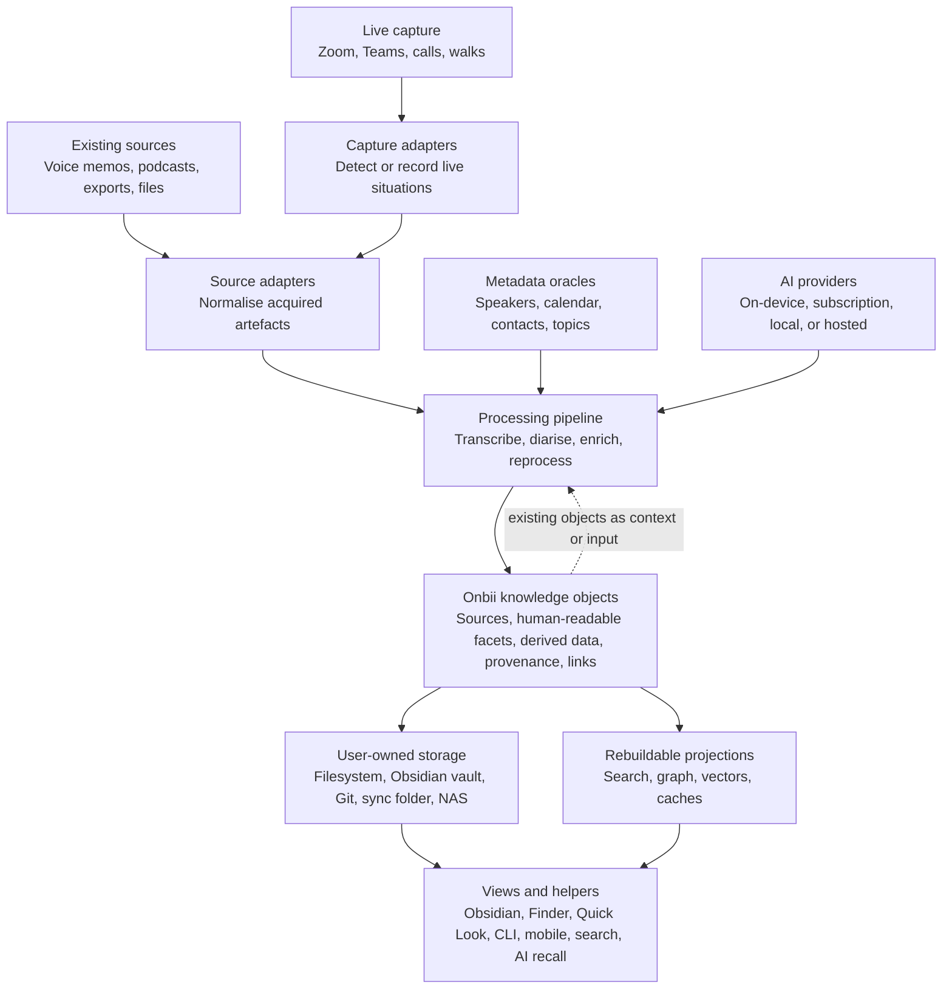

# Principles

These principles describe the design direction of Onbii. They are not a complete specification, but they should guide specification work, examples, adapters, and future implementations.

## Human First

> Onbii exists for people, not for AI agents.

The purpose is to help people retain, inspect, connect, and reuse knowledge that would otherwise be scattered across products, clouds, chats, recordings, notes, and applications. A person should be able to understand where their knowledge is, what it contains, where it came from, and how it has changed.

Technical machinery should support that goal without becoming the thing the user has to understand.

## Local First

> Onbii should work with knowledge that remains under the user's control.

A single device and a local folder should be enough for a useful Onbii archive. Cloud services may provide synchronisation, backup, collaboration, hosting, or processing, but they should be optional. They must not become the only place where knowledge can exist.

The answer to "where is my knowledge?" should be something ordinary and inspectable, not a vendor backend.

## User-Owned Knowledge Store

> Onbii should not own the user's knowledge.

The user's own storage is central: a filesystem, an Obsidian vault, Git, iCloud Drive, Dropbox, OneDrive, Nextcloud, Syncthing, a NAS, or another user-chosen location. Applications and services may read, enrich, index, render, or synchronise that knowledge, but they should not become the source of ownership.

## Open Specification

> Onbii is first an open specification.

The specification defines how knowledge objects, bundles, source material, derived artefacts, links, and provenance can be represented in a portable way. Implementations should be able to create, inspect, validate, transform, and render Onbii knowledge without depending on a single application, company, model, database, or operating system.

## Knowledge Objects, Not Loose Files

> Knowledge should be represented as objects with identity, resources, metadata, provenance, and links.

A conversation is not just a Markdown file. It may include original audio, a transcript, speaker corrections, summaries, attachments, source metadata, generated annotations, and relationships to other objects. Those belong together.

The user should be able to move, copy, back up, or delete one understandable thing. Internally, that thing may contain many ordinary files.

## Preserve Sources

> Original source material should be preserved wherever practical.

For audio, the original recording is the source. For an imported document, the imported file is the source. For a photo, the image is the source. Derived artefacts such as transcripts, summaries, extracted entities, embeddings, suggested links, or generated notes can be recreated as tools improve.

A lost source cannot be regenerated.

## Derived Data Is Not Truth

> AI and processing tools produce interpretations.

Those interpretations may be useful, searchable, and even essential to workflows, but they should remain distinguishable from the source material and from human edits. A generated transcript, summary, topic, classification, embedding, or relationship should carry provenance: what created it, from what input, when, and under what assumptions.

## Human Edits Are First-Class

> Human corrections and annotations matter.

Correcting a transcript, assigning a speaker, editing a title, adding context, or approving a summary changes the knowledge object. Those changes should be preserved and marked as human edits. Reprocessing should not silently overwrite them.

If a newer model creates a better transcript or summary, it should produce another version or proposed update while preserving the human work.

## Applications Are Views

> Onbii is not a note-taking application, AI assistant, recorder, cloud platform, or database.

Obsidian, a mobile app, a desktop app, a CLI, Finder or Quick Look, VS Code, a search interface, and an AI chat surface can all be views over the same underlying knowledge. None of those views should be required to remain usable forever.

Knowledge should outlive the applications that touch it.

## Small Helpers Are Welcome

> A helper should reveal an object, not own it.

Onbii should not require a full Onbii application before an object becomes useful. Small readers, previews, plugins, projections, or command-line tools may appear early if they help people inspect, trust, or move knowledge objects.

A basic Obsidian reader, Finder or Quick Look preview, text projection, or tiny viewer is valuable when it makes the object easier to understand. Those helpers should remain surfaces over user-owned objects rather than becoming the place where the knowledge truly lives.

## Bring Your Own Components

> Onbii should not require one recorder, one AI provider, one database, one sync service, or one application.

People should be able to bring their own recorder, storage, sync, AI, and client applications. The specification should define the boundaries that allow those pieces to interoperate.

This is especially important because capture devices, speech models, AI providers, and user preferences change quickly.

## Source Pluralism

> The perfect capture device is different for everyone.

One person may use Plaud. Another may use Apple Voice Memos. Another may prefer Omi, a ring, a bracelet, a desktop capture widget, a podcast import, a YouTube recording, a Zoom export, or a file dropped into a folder.

Onbii should not make the wearable, recorder, or application the centre of the design. Sources are replaceable edge components.

## Clear Boundaries

> The architecture should keep responsibilities separate.

Source adapters normalise acquired artefacts so they can enter the Onbii pipeline. Capture adapters may detect or record live situations and pass their result onward. Processing tools and oracles may transcribe, identify speakers, classify, summarise, link, or enrich. Storage keeps the object and its resources. Applications render views.

Those boundaries should stay clear even when an implementation combines several of them for convenience.

## Machine Optimisation Is Rebuildable

Graphs, vector indexes, search indexes, entity stores, caches, and databases can be useful, but they should not be the only form of the user's knowledge.

Users should not have to run Neo4j, understand graph theory, operate Pinecone, or depend on a proprietary backend to access their own archive. Machine-optimised structures should be rebuildable from the knowledge objects and their provenance.

## Stable Identity Over Filenames

> Objects should have stable identities.

Filenames, titles, locations, and folder structures change. Links and relationships should not break merely because a user renamed a meeting, moved a bundle, or reorganised a folder.

Human-readable names are important for usability. Stable identifiers are important for durability.

## Low Friction

> Onbii should reduce the burden of capturing and preserving knowledge.

The goal is not to create a system that only works for tinkerers. It should not require a user to operate a backend, understand a graph database, manually upload every object, or perform fragile file choreography.

When complexity is necessary, it should sit below the surface.
